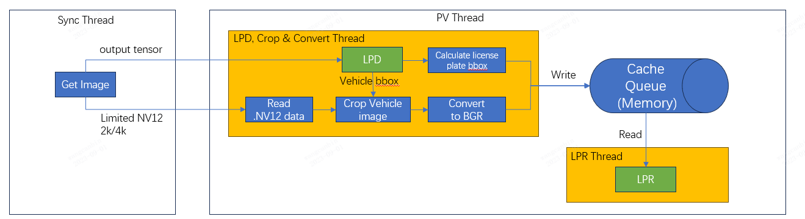

# type4_parking_online

## 1. Introduction

This sample shows how to use tetras Type4 LPR SDK. 


## 2. Modify configuration param
Modify the ZoomInParam on Type4 LPR sdk to, the 'type4_parking_online' tool crop vehicle image and send it to LPR_run api.
"
    "ZoomInParam": {
        "input_tensor_x_magnify": 1,
        "input_tensor_y_magnify": 1,
        "input_tensor_x_offset": 0,
        "input_tensor_y_offset": 0
    },
"

Modify the params on 'config.json': "license_path", "model_path", "lpd_param_path", "lpr_param_path", "inference_path" and "raw_path".


## 3. How to run
### 3.1 Start type4_parking_online firstly

```shell
LD_LIBRARY_PATH=path of LPR sdk lib ./type4_parking_online config.json
```
For example


It will take some time to initialize the Gaze model on NPU(about 10s), please wait patiently until the initialization is complete. You can see "" in terminal. Than go to step 3.2

### 3.2 Start camera app
Please refer to CameraAppContainer.pdf released by SSS to setup type4 CameraAppContainer.
Please ensure that the OTA model is correctly.

### start CameraAppContainer
### start to generate output tensor and 4k NV12 image
```
curl -d '{"method": "StartUploadInferenceDataAndRaw", "params": { "Mode":2, "UploadMethod":"Local", "FileFormat":"JPG", "UploadMethodIR": "Local", "FileFormatIR":"BIN", "CropHOffset" : 0, "CropVOffset" : 0, "CropHSize" : 4032, "CropVSize" : 3040, "FileFormatRaw":"NV12", "UploadMethodRaw":"Local",  "CropHOffsetAP":0, "CropVOffsetAP":0, "CropHSizeAP":4032, "CropVSizeAP":3040,"NumberOfImages":0, "NetworkID":"000000" }}' http://x.x.x.x:8080/directcommand
```

And then the tool will read and process output tensor and 4k NV12 image on '/misc/smartcamera/dnn_out' folder.

